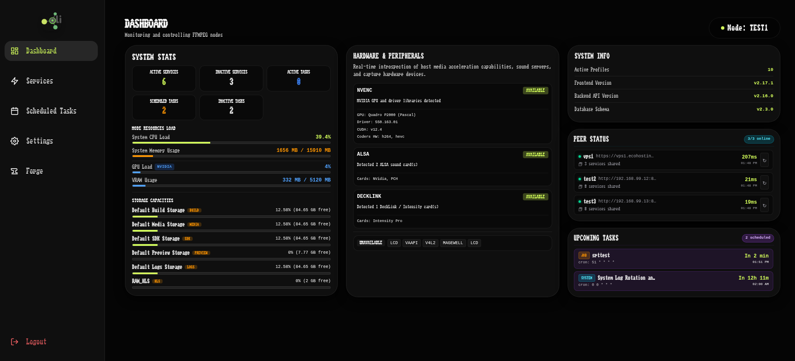
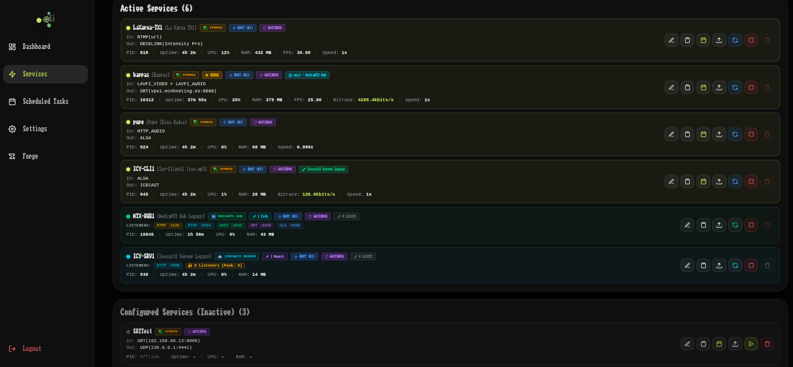
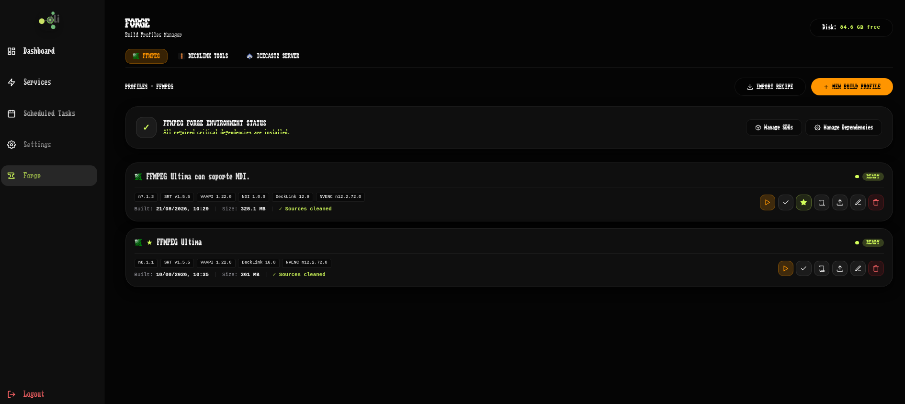
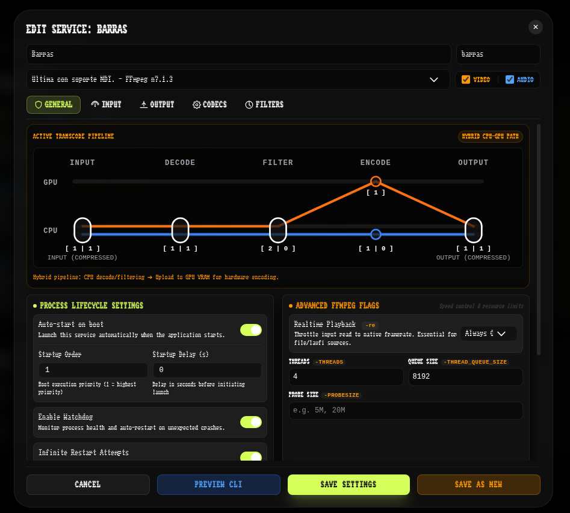
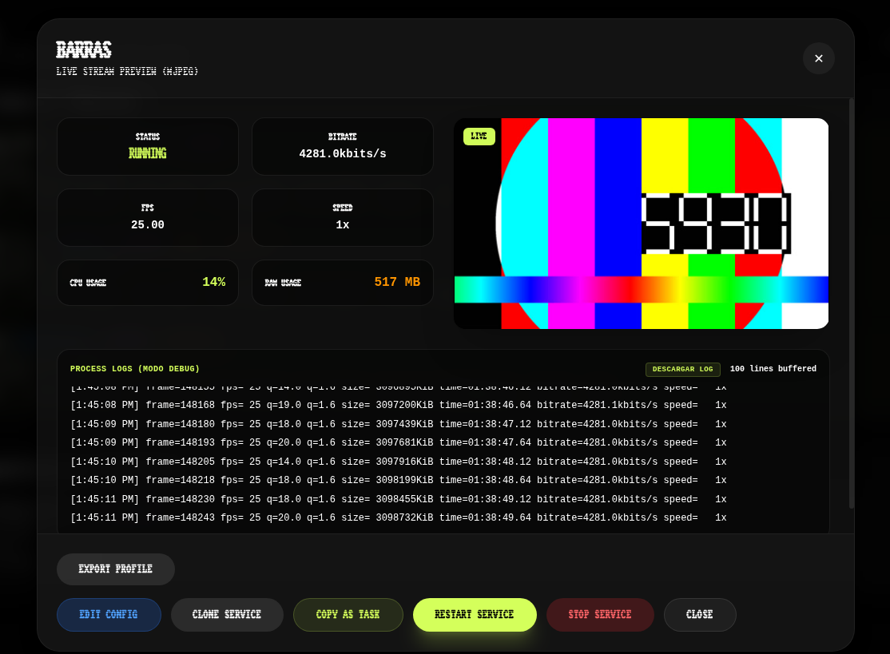
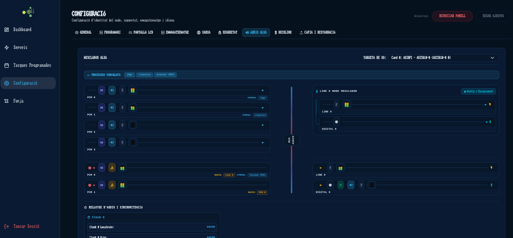
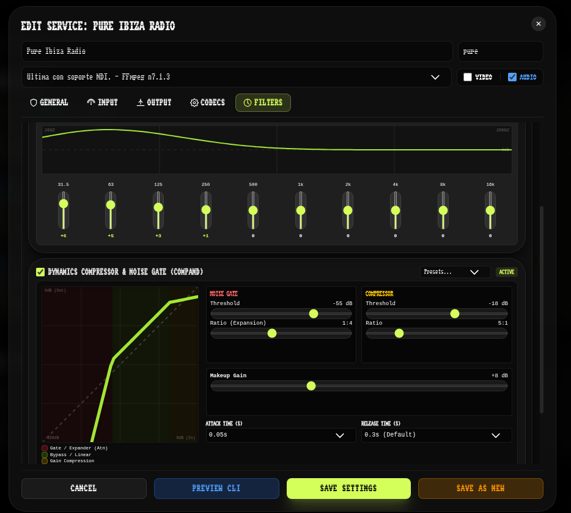
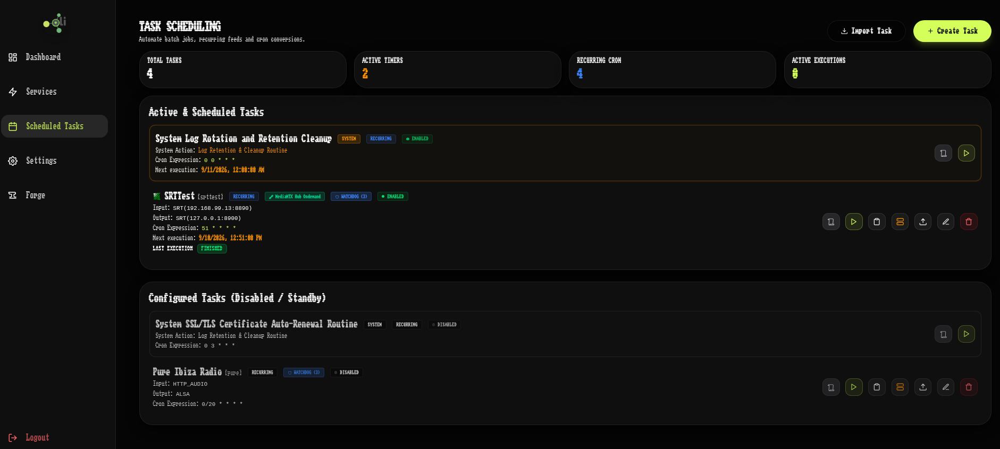
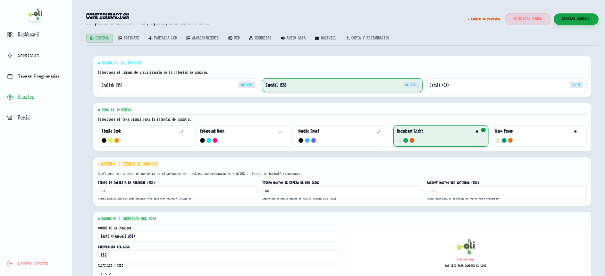

# FFmpeg-GUI Orchestrator

FFmpeg-GUI is a feature-rich orchestrator and management panel designed to compile, automate, monitor, and configure persistent stream pipelines and custom FFmpeg binaries. 

Inspired by high-reliability systems and developer utility, it provides an intuitive wrapper around the FFmpeg CLI, turning complex console commands into visual, resilient, and manageable services.

---

## Core Features

### 🛠️ 1. Multi-Engine Forge & Toolchain Builder
- **In-App Compilation**: Compile custom binaries from source directly from the panel. Select specific repository tags and configure compiler options for multiple software engines:
  - **FFmpeg**: Video/audio transcoding and muxing with full hardware codec bindings.
  - **DeckLink Tools (`decklink-ctl`)**: Headless hardware control and telemetry helper for Blackmagic PCIe devices.
  - **Icecast2**: High-performance audio streaming broadcast server.
  - **MediaMTX**: Multi-protocol zero-dependency media hub (SRT, WebRTC, RTSP).
  - **Kiosk Cog**: Wayland/X11 web kiosk display browser.
- **External SDK Management**: Automated uploading, extraction, and compilation binding for proprietary SDKs:
  - **Blackmagic DeckLink SDK**: Capture and playback support from professional PCIe hardware.
  - **NewTek NDI SDK**: High-quality IP video routing support.
  - **NVIDIA CUDA & NVENC/NVDEC**: Optional hardware-accelerated decoding/encoding integration (compiles cleanly on CPU-only hosts without NVIDIA hardware).
  - **Intel QuickSync (QSV) & VAAPI**: Hardware-accelerated transcoding support for Intel graphics processors.
  - **SRT (Secure Reliable Transport)**: Compiles with `libsrt` support.

### 📺 2. Media Services & Daemon Streams
- **Persistent Pipelines**: Run RTMP, SRT (listener/caller), HLS, NDI, UDP, or ALSA audio streams as persistent background daemons.
- **Boot Sequence Hierarchies**: Configure specific startup ordering and delay gaps to synchronize cross-dependent streams (e.g., waiting for an input stream to initialize before starting a transcoder).
- **GPU/CPU Pipeline Diagramming**: An interactive resource pipeline diagram in the GUI that visually tracks GPU decoding, filtering, encoding, and CPU multiplexing flow.
- **Live Frame Previews**: Periodically captures frame snapshots from active streams to monitor quality directly from the dashboard.

### 🎛️ 3. Professional AV Hardware & Control
- **Blackmagic DeckLink Hardware Control**: Headless SDI/HDMI connector mapping (half/full duplex), real-time signal lock and format telemetry, and card firmware verification/flashing (`BlackmagicFirmwareUpdater`).
- **Magewell Capture Cards**: Reliable integration with HDMI/SDI input capture via V4L2.
- **AudioScience Soundcards**: Advanced ALSA hardware support, resolving topology mapping and crosspoint volume matrix routing.
- **Graphical Overlay Studio**: Fully graphical editor to place, scale, and preview graphic overlays on top of video streams.
- **Audio Dynamics & Filters**: Dynamic range compressors, multi-band graphic equalizers, and ALSA loopback routing.

### 🛡️ 4. Decoupled Watchdog Recovery
- **Automatic Auto-Start**: Recovers crashed or disconnected streams automatically.
- **Freeze Protection**: Actively monitors process FPS, bitrate, and outputs, force-restarting streams if frames freeze or connection drops.
- **Jittered Backoff**: Uses exponential backoff delays combined with randomized jitter to break lockstep recovery loops and reduce server resource peaks during network outages.

### ⏰ 5. Task Scheduler & Bilateral Cloning
- **Automation Jobs**: Schedule recurring (cron-like) or one-shot encoding tasks (e.g., recording daily broadcasts, scheduled stream dumps).
- **Safety Runtime Limits**: Define max duration timers to automatically clean up active tasks.
- **Bilateral Cloning**: Seamlessly convert any active or stopped media service into a scheduled task template, or duplicate a task config into a running daemon service with a single click.

### 🔒 6. HTTPS & Let's Encrypt SSL Manager
- **Automated SSL/TLS Certificates**: Request and renew Let's Encrypt certificates directly from the GUI panel.
- **ACME Challenge Handler**: Integrated HTTP-01 challenge router (`/.well-known/acme-challenge/*`) for automated domain verification.
- **Status & Monitoring**: Real-time display of certificate validity, domain bindings, and automated expiration warnings.

### 💾 7. Granular Backup & Restore
- **Selective Section Toggles**: Export and import specific configuration parts (e.g., only backing up media services and scheduled tasks while leaving SMTP credentials or network port configs unchanged).
- **Format Verification**: Validates file integrity, application signature, and version compatibility before performing atomic SQLite database insertions and config file updates.

### 🗄️ 8. Storage, Log Retention & Branding
- **Storage Management**: Configure local or mounted storage volumes, monitor disk space usage in real time, and trigger notifications if volume capacity exceeds limits.
- **Automated Log Rotation**: Fine-grained settings to define retention limits for application logs, task logs, and stream outputs, automatically purging stale data to prevent disk saturation.
- **Branding Customization**: Customize the application name, panel headers, and console branding directly from the interface settings.

### 🔔 9. State-Based SMTP Notifications
- **Alert Fatigue Prevention**: Stateful notification queue that filters redundant alerts. Emails are dispatched exclusively on initial stream crashes, recovery success, and final retry exhaustion.
- **System Health Checks**: Active warnings for pending SSL/TLS certificate expirations and disk space utilization exceeding 90%.

### 📟 10. CFA635 LCD Display Driver
- **Serial LCD Integration**: Direct driver control for CrystalFontz CFA635 USB/Serial displays. Renders live CPU, RAM, active stream counts, locator beacons, and handles backlight dimming timeouts.
- **Bicolor Status LEDs**: Maps physical LEDs to profile monitors:
  - Heartbeat status indicator.
  - Active stream/service health.
  - Task execution monitor (reflects latest execution results).
  - High-resource alerts.

### 🌐 11. Styling & Localization
- **Multi-Theme Engine**: 5 visual styles (Studio Dark, Cyberpunk Neon, Nordic Frost, Broadcast Light, Warm Paper) loaded instantly without page flash.
- **Full Translations**: English, Spanish, and Catalan interfaces with 100% i18n parity.

---

## Architecture

- **Backend**: FastAPI (Python), SQLite (SQLAlchemy), and Uvicorn.
- **Frontend**: React 19, TypeScript, Vite, Tailwind CSS, and `react-i18next`.
- **System Wrapper**: Integrates with systemd service units running in user-space or system-wide space.

---

## Development Note

This project has been developed entirely in pair-programming using AI agent tools (collaborating with Google DeepMind's Antigravity coding assistant).
