# FFmpeg-GUI Orchestrator

FFmpeg-GUI is a feature-rich orchestrator and management panel designed to compile, automate, monitor, and configure persistent stream pipelines and custom FFmpeg binaries. 

Inspired by high-reliability systems and developer utility, it provides an intuitive wrapper around the FFmpeg CLI, turning complex console commands into visual, resilient, and manageable services.

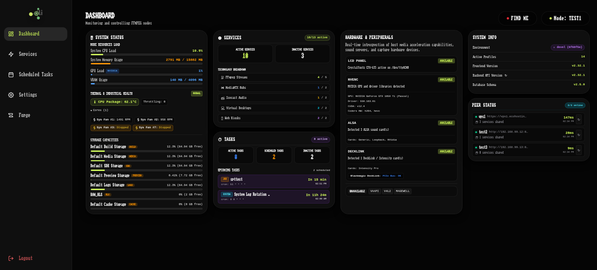

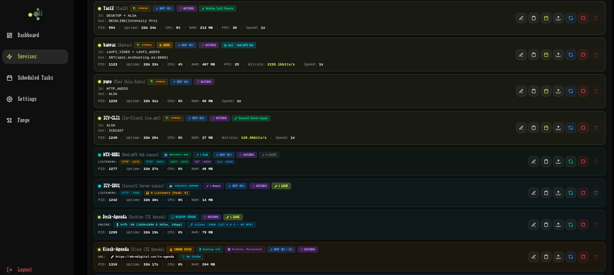

---

## Core Features

### 🛠️ 1. Multi-Engine Forge & Toolchain Builder
- **In-App Compilation**: Compile custom binaries from source directly from the panel. Select specific repository tags and configure compiler options for multiple software engines:
  - **FFmpeg**: Video/audio transcoding and muxing with full hardware codec bindings.
  - **DeckLink Tools (`decklink-ctl`)**: Headless hardware control and telemetry helper for Blackmagic PCIe devices.
  - **Icecast2**: High-performance audio streaming broadcast server.
  - **MediaMTX**: Multi-protocol zero-dependency media hub (SRT, WebRTC, RTSP).
  - **Kiosk Cog**: Wayland/X11 web kiosk display browser.
- **External SDK Management**: Automated uploading, extraction, and compilation binding for proprietary SDKs:
  - **Blackmagic DeckLink SDK**: Capture and playback support from professional PCIe hardware.
  - **NewTek NDI SDK**: High-quality IP video routing support.
  - **NVIDIA CUDA & NVENC/NVDEC**: Optional hardware-accelerated decoding/encoding integration (compiles cleanly on CPU-only hosts without NVIDIA hardware).
  - **Intel QuickSync (QSV) & VAAPI**: Hardware-accelerated transcoding support for Intel graphics processors.
  - **SRT (Secure Reliable Transport)**: Compiles with `libsrt` support.

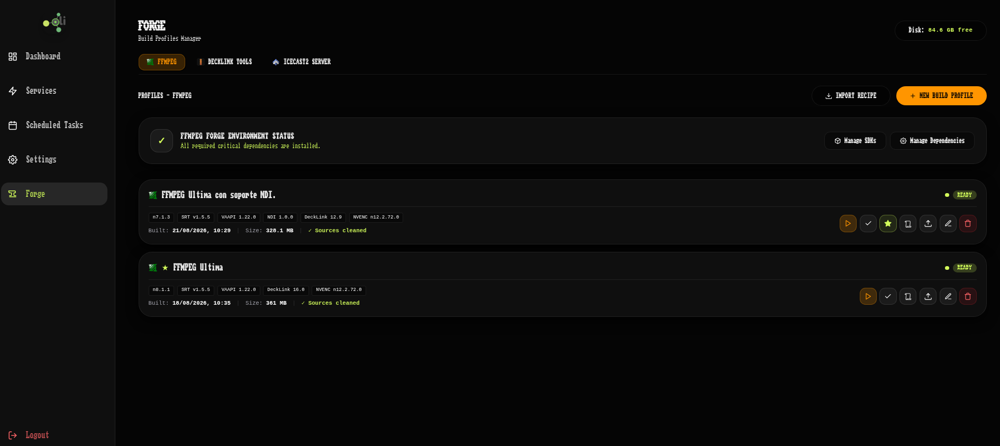

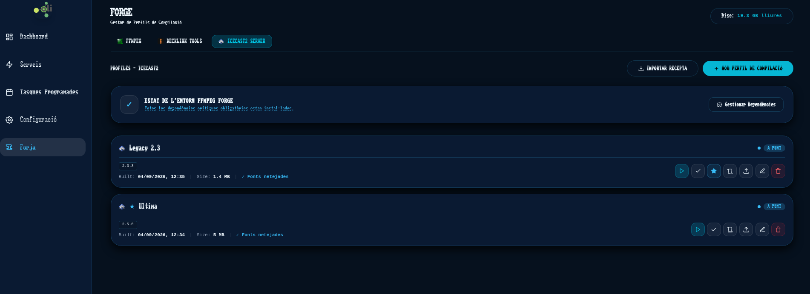

### 📺 2. Media Services & Daemon Streams
- **Persistent Pipelines**: Run RTMP, SRT (listener/caller), HLS, NDI, UDP, X11 Virtual Desktop (`x11grab`), or ALSA audio streams as persistent background daemons.
- **Virtual Desktop Ingest & Intelligent Audio/FPS Sync**: Ingest uncompressed video from X11 Virtual Desktops with automatic geometry adoption, 1-click framerate alignment, and 1-click ALSA loopback audio pairing (`hw:Loopback,1,X`) to prevent audio desync or FFmpeg stream mapping crashes.
- **Boot Sequence Hierarchies**: Configure specific startup ordering and delay gaps to synchronize cross-dependent streams (e.g., waiting for an input stream to initialize before starting a transcoder).
- **GPU/CPU Pipeline Diagramming**: An interactive resource pipeline diagram in the GUI that visually tracks GPU decoding, filtering, encoding, and CPU multiplexing flow.
- **Live Stream Previews**: Embedded native HLS live video & audio player for HLS broadcast services, plus configurable periodic frame snapshots (MJPEG) with performance toggles for other streaming outputs.

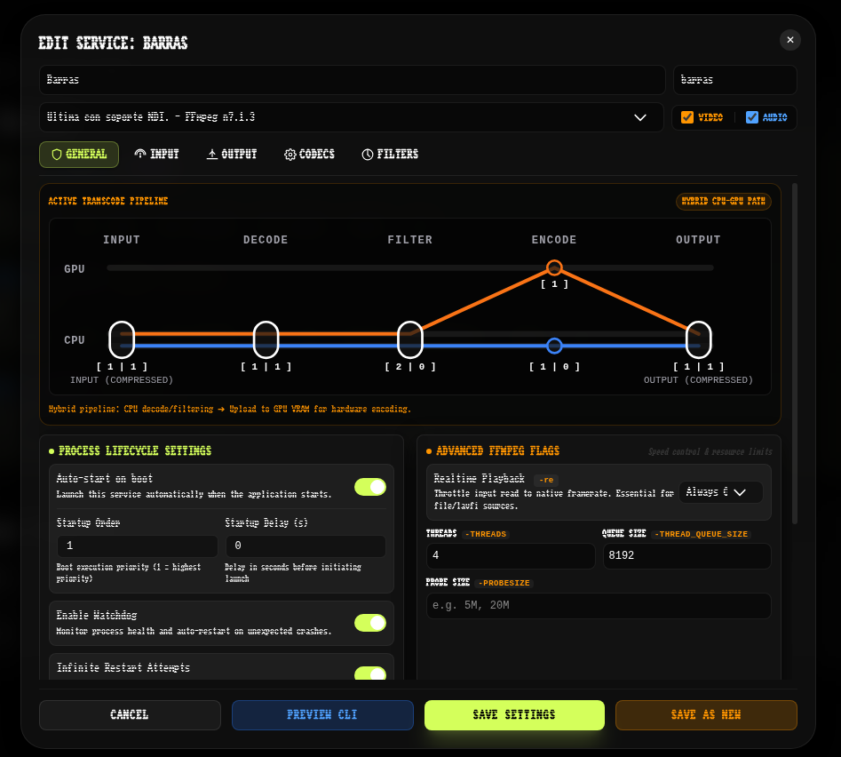

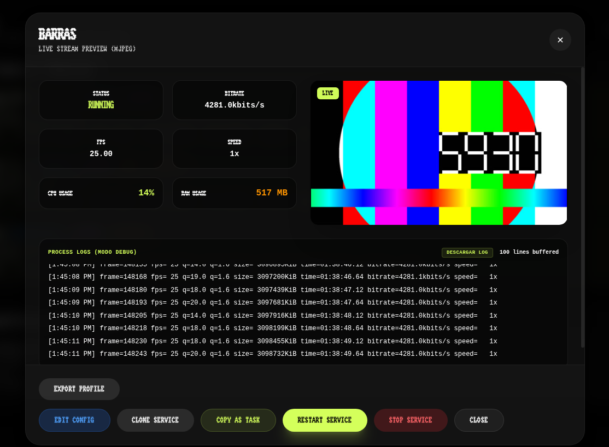

### ⚡ 3. MediaMTX Hub, Stream Paths & SSL/TLS Integration
- **Multi-Protocol Zero-Dependency Hub**: Deploy standalone MediaMTX daemon instances orchestrated through ephemeral YAML configs written to RAM (`/dev/shm`).
- **Universal Stream Paths & Granular Security**: Configure routing rules (`inherit`, `custom`, `open` LAN modes) with decoupled Publish (Push) and Read (Pull) credentials per path.
- **In-RAM HLS Live Distribution & Storage Persistence**: Serves live HLS ultra-fast from RAM ring buffers without disk wear, with optional continuous stream recording to dedicated HLS storage volumes.
- **Bidirectional SRT Access Control**: Formats and parses SRT stream IDs (`#!::r=<path_id>,m=<publish|request>[,u=...,p=...]`) with interactive Hub connection assistants across FFmpeg sources and destinations.
- **SSL/TLS Security & Collision Protection**: Local Let's Encrypt / custom certificate binding for RTMPS and RTSPS with automatic $+10$ port offset safety allocation.
- **Live Stream Connection Matrix**: 1-click clipboard copy matrix for RTMP/S, RTSP/S, SRT, WebRTC (WHEP/WHIP), and HLS playback/ingest strings.

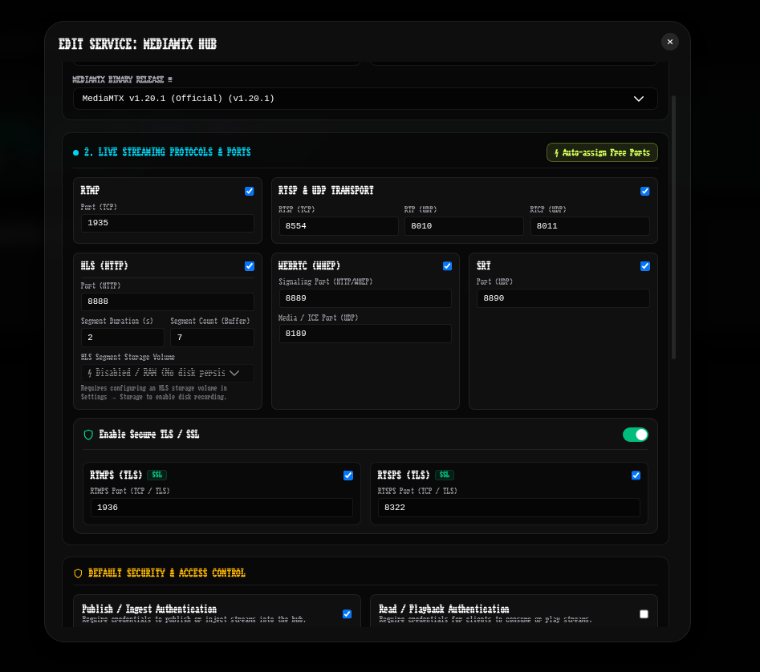

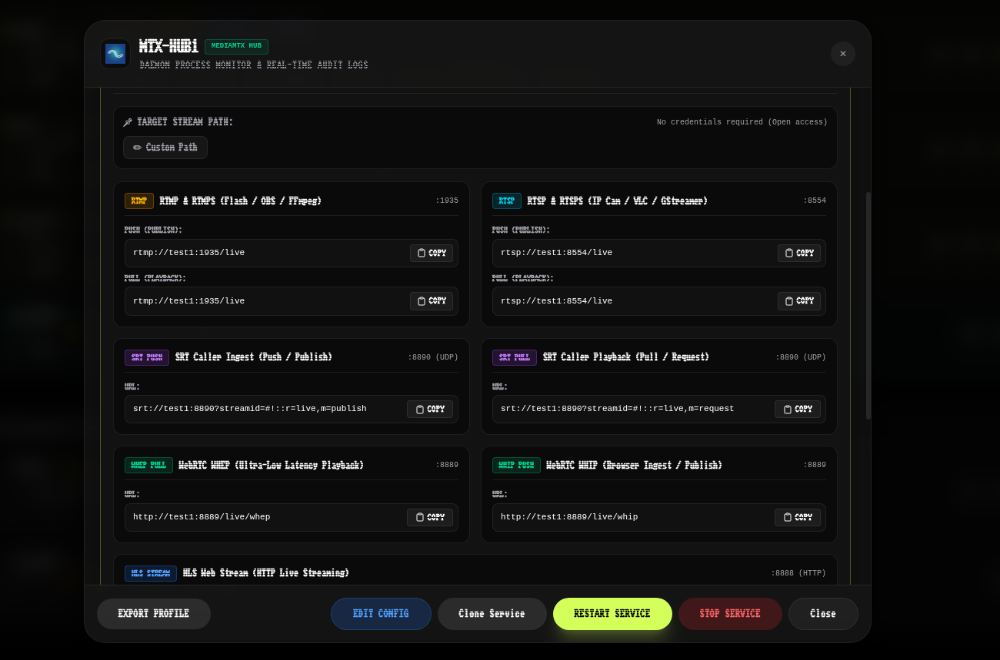

### 📻 4. Icecast2 Audio Broadcasting & Radio Hub
- **Native Service Orchestration**: Manage dedicated Icecast2 server daemons directly alongside FFmpeg and MediaMTX pipelines.
- **Dual HTTP & HTTPS/TLS Sockets**: Run unencrypted listener sockets (TCP 7000) and encrypted TLS streams (TCP 7443) simultaneously with automated concatenated PEM certificate bundles.
- **Interactive Server Preview & Live Player**: Monitor stream status with an embedded live web iframe preview, HTML5 in-browser audio player for active mountpoints, listener counters, and real-time logs.
- **Static & Dynamic Mountpoint Management**: Configure granular mountpoints with max audience limits, fallback drop protection (`fallback-mount` / `fallback-override`), and burst buffers.
- **Audience & Telemetry Monitoring**: Real-time `/status-json.xsl` and `/admin/stats.xml` telemetry polling directly into service cards and preview modal.
- **Automated Native Log Rotation & Lifecycle**: Configurable `<logsize>` and `<logarchive>` native rotation coupled with system scheduled tasks (`system://log_rotate`) for automated `.gz` compression, retention purging, and orphan cleanup.
- **FFmpeg Output Hub Integration**: 1-click Icecast destination assistant auto-negotiating container format and MIME types according to audio codecs (MP3, AAC, Opus, FLAC) with broadcast metadata tags (`-ice_name`, `-ice_genre`, `-ice_description`).
- **Recipe Management & Conflict-Free Cloning**: Universal recipe export/import (`software_build_recipe` v2) and dedicated 1-click service cloning with collision-free port allocation.

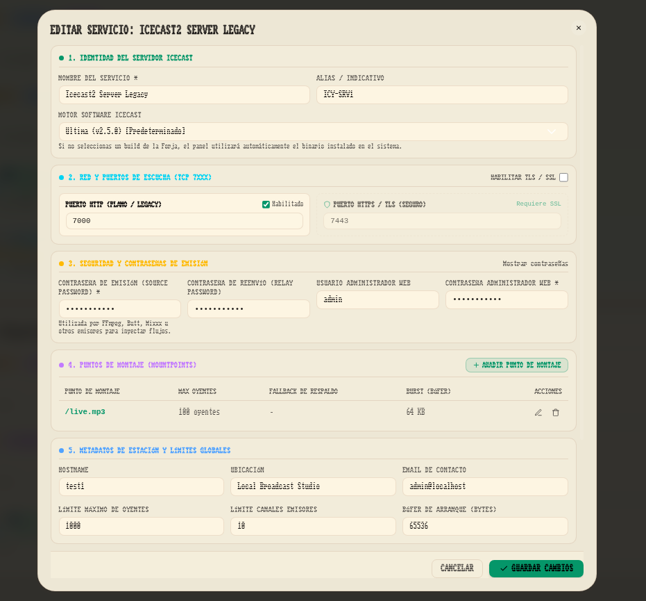

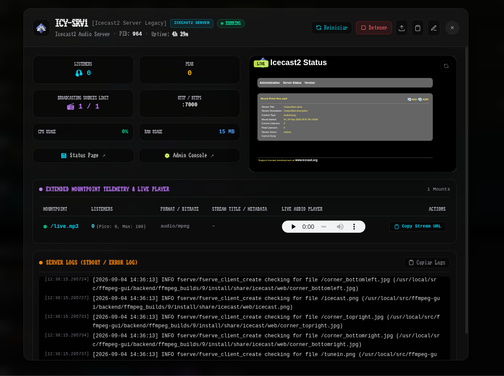

### 🌐 5. Multi-Peer Federation & Auxiliary Service Sharing
- **Cluster Pairing & Cryptographic Inbound Keys**: Securely connect distributed `ffmpeg-gui` instances (e.g., edge transcoders and cloud relays). Generate signed pairing tokens (`FGPEER-...`) backed by AES-256-GCM pre-shared encryption keys and token identifiers (`fgp_k_...`).
- **Encrypted RPC & Service Catalog Exchange**: Remote nodes periodically synchronize catalogs of shared auxiliary services (MediaMTX Hubs, Icecast2 mountpoints) over encrypted zero-trust RPC endpoints without exposing administrative UI access.
- **Transparent Remote Leasing**: FFmpeg processes and automated scheduled tasks can bind to remote services as sources or destinations. The orchestrator automatically leases the remote service, provides real-time keep-alive heartbeats, and releases the lease upon process termination.
- **Latency & Cluster Health Monitoring**: Real-time round-trip latency tracking displayed in the Dashboard and Network settings. Supported on physical front-panel LCD displays via the dedicated `P2P` bi-color LED health profile.

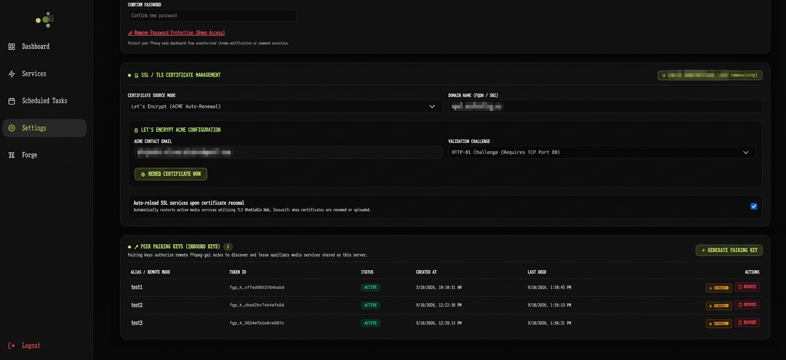

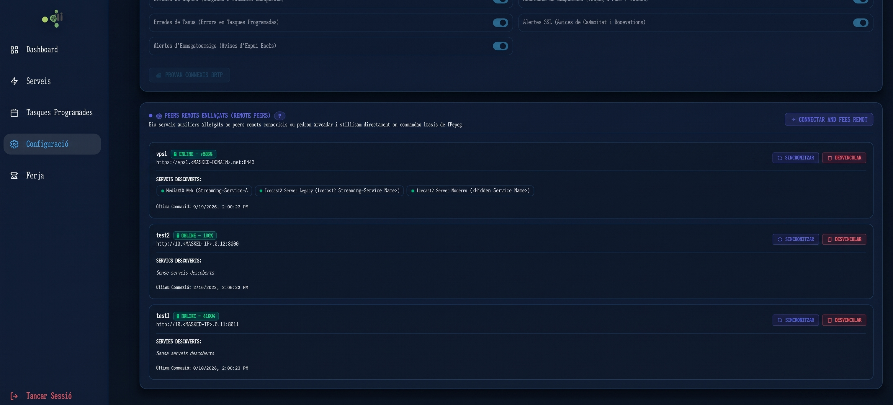

### 🖥️ 6. Virtual Desktops, Web Kiosks & Ingest
- **X11 Headless Virtual Desktops**: Spawn managed `Xvfb` and `x11vnc` virtual display sessions with configurable resolution, framerate, client-side cursor, and automatic watchdog self-healing.
- **Embedded noVNC Remote Display**: Full interactive remote control directly within the browser interface, with live connection status, display scaling, and fullscreen view.
- **Unattended Web Kiosks (Chromium & Firefox ESR)**: Deploy automated browser kiosks targeting specific virtual desktops with popup/first-run suppression, auto-fullscreen via `xdotool`, and GPU acceleration.
- **Persistent Profiles & Flash Storage Protection**: Decoupled profile architecture preserving cookies and logins across reboots while running cache on fast memory disks (`/dev/shm`) or disabled to protect SATADOM/SD storage.
- **Direct FFmpeg Desktop Ingest (`x11grab`)**: Capture live video feeds from virtual desktops into FFmpeg pipelines with 1-click 1:1 geometry/framerate alignment and secondary ALSA loopback audio pairing.

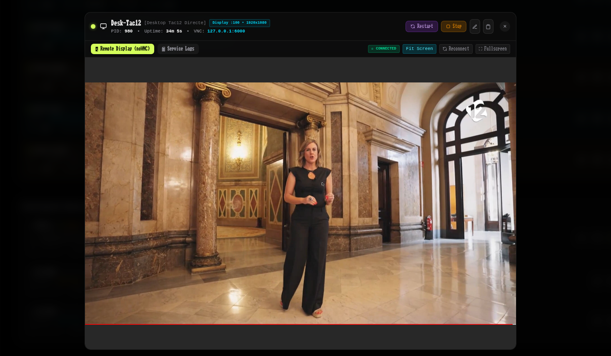

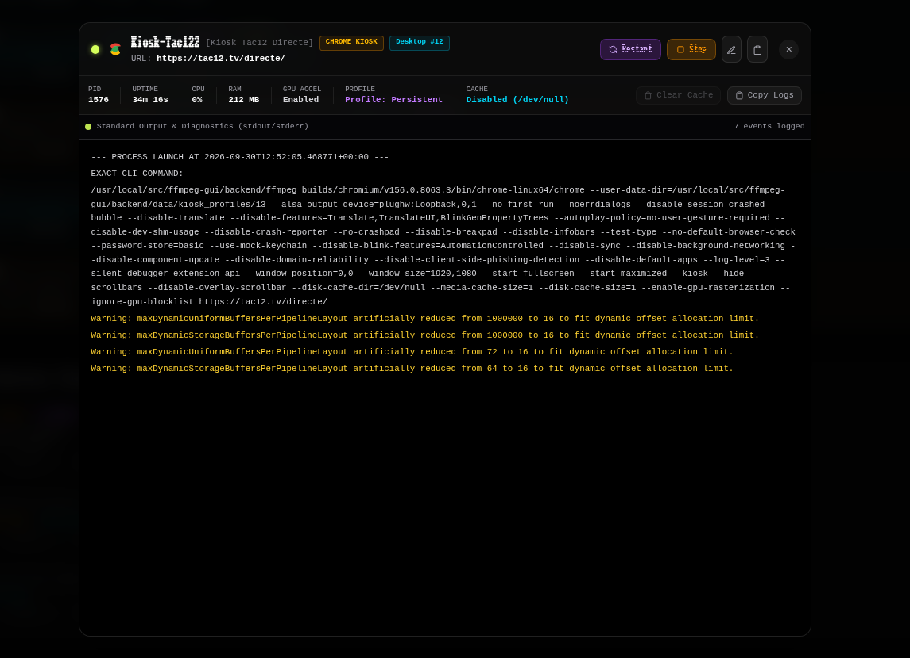

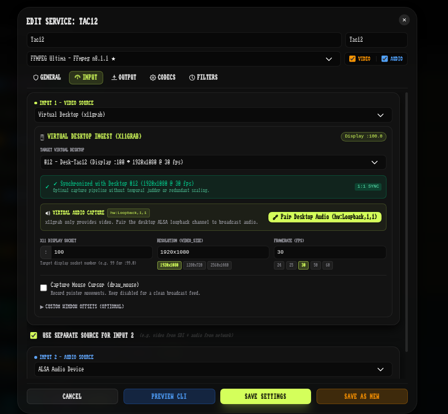

### 🎛️ 7. Professional AV Hardware & Control
- **Blackmagic DeckLink Hardware Control**: Headless SDI/HDMI connector mapping (half/full duplex), real-time signal lock and format telemetry, and card firmware verification/flashing (`BlackmagicFirmwareUpdater`).
- **Magewell Capture Cards**: Hardware telemetry and routing for Pro Capture / Eco Capture / USB Capture devices (`mwcap-info` / `mwcap-control`), live FPGA temperature monitoring, connector switching, and V4L2/ALSA stream integration.
- **AudioScience Soundcards**: Advanced ALSA hardware support, resolving topology mapping, crosspoint volume matrix routing, and real-time DSP core load (%) and hardware temperature (°C) telemetry via `hpicontrol.py`.
- **ALSA Loopback (`snd-aloop`) Routing**: Clean 8-subdevice virtual topology in the ALSA mixer with browser audio sandboxing (`asound.conf`), 1-click secondary audio pairing for virtual desktops, and fixed routing indicators (`◄ PCM X Playback`) between playout (`hw:Loopback,0,X`) and broadcast ingest (`hw:Loopback,1,X`).
- **Graphical Overlay Studio**: Fully graphical editor to place, scale, and preview graphic overlays on top of video streams.
- **Audio Dynamics & Filters**: Dynamic range compressors, multi-band graphic equalizers, and ALSA loopback routing.

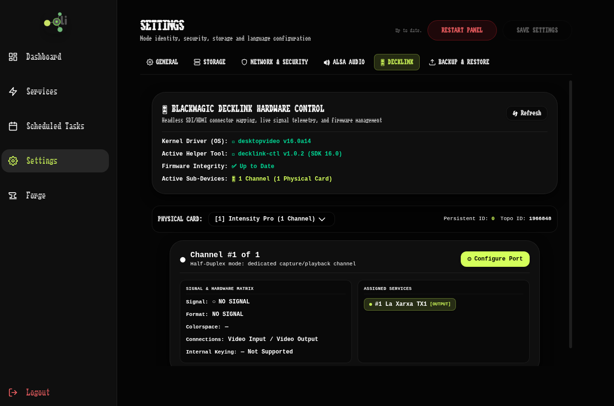

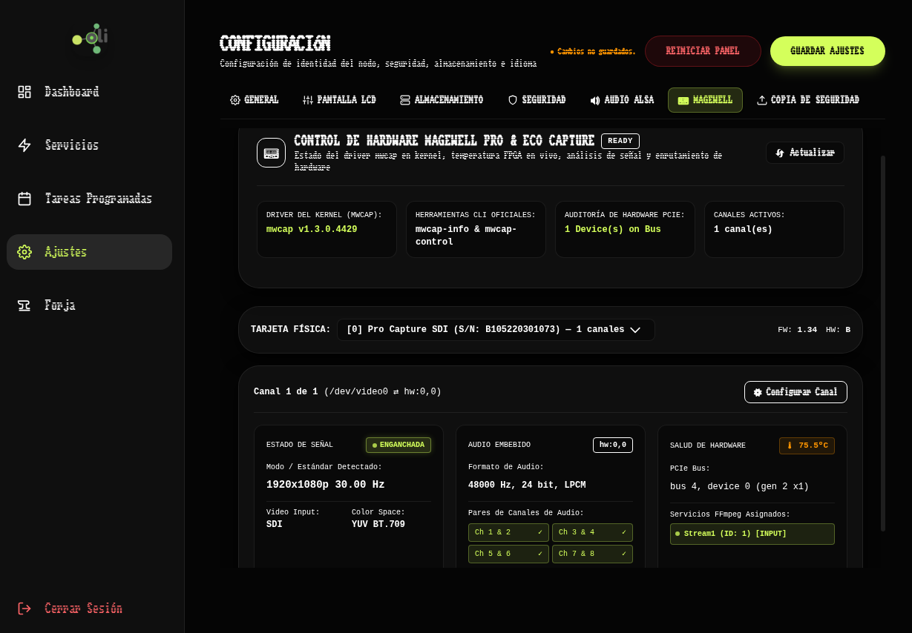

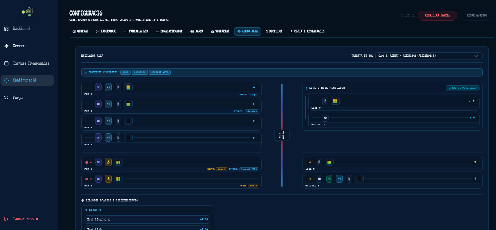

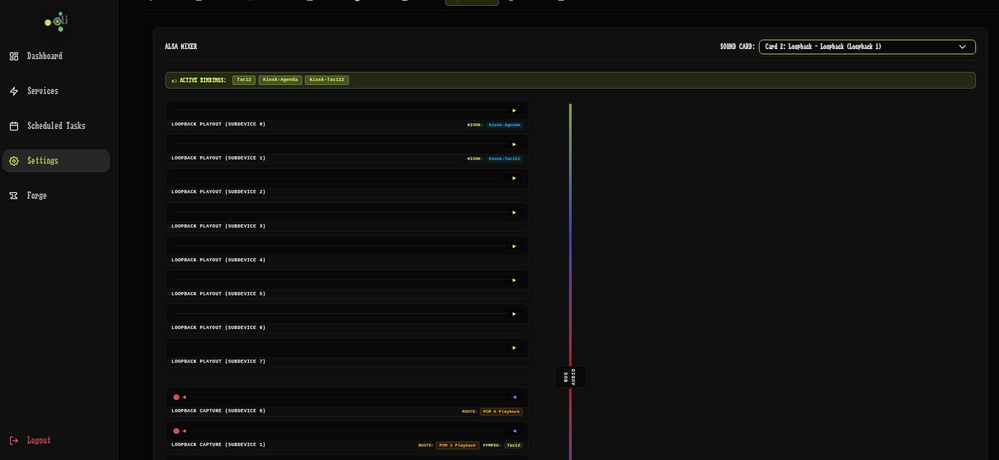

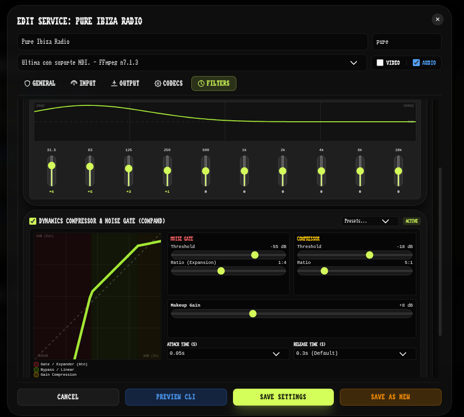

### 🎚️ 8. PipeWire Audio Hub & Universal Audio Matrix
- **Isolated Daemon Orchestration**: Deploy dedicated PipeWire server daemons running entirely in ephemeral RAM directories (`/tmp/ffmpeg-gui/pipewire-{id}`) with custom quantum and sample rate (48000 Hz) isolation.
- **Virtual Audio Sinks & AES67 Multicast Broadcast**: Configure custom multi-channel virtual audio sinks (`mix_bus`, `kiosk_audio`, etc.) with optional AES67 / Dante multicast broadcast output over physical network interfaces with PTP clock domain support.
- **Desktop & Web Kiosk Native Audio Routing**: Route Virtual Desktop and Kiosk audio directly to PipeWire sinks via native PulseAudio emulation sockets (`PULSE_SERVER`), completely bypassing legacy `apulse` or `snd-aloop` constraints.
- **Universal FFmpeg Audio Matrix**:
  - Ingest directly from virtual bus monitors (`-f pulse -i <sink>.monitor`).
  - Playout directly into virtual sinks (`-f pulse <sink>`).
  - Bit-perfect 0% CPU Stream Copy (`-c:a copy`) passthrough between raw sources/destinations (ALSA, PipeWire, RTSP, RTP, file recording).
  - Automated lease management keeping the PipeWire daemon alive while active consumers stream and stopping cleanly on idle.
- **Real-Time Graph & Node Inspector**: Telemetry modal providing real-time audio graph visualization (`pw-dump`), listing all active nodes, ports, links, and execution states.

### 🛡️ 9. Decoupled Watchdog Recovery
- **Automatic Auto-Start**: Recovers crashed or disconnected streams automatically.
- **Freeze Protection**: Actively monitors process FPS, bitrate, and outputs, force-restarting streams if frames freeze or connection drops.
- **Jittered Backoff**: Uses exponential backoff delays combined with randomized jitter to break lockstep recovery loops and reduce server resource peaks during network outages.

### ⏰ 10. Task Scheduler & Bilateral Cloning
- **Automation Jobs**: Schedule recurring (cron-like) or one-shot encoding tasks (e.g., recording daily broadcasts, scheduled stream dumps).
- **Safety Runtime Limits**: Define max duration timers to automatically clean up active tasks.
- **Bilateral Cloning**: Seamlessly convert any active or stopped media service into a scheduled task template, or duplicate a task config into a running daemon service with a single click.

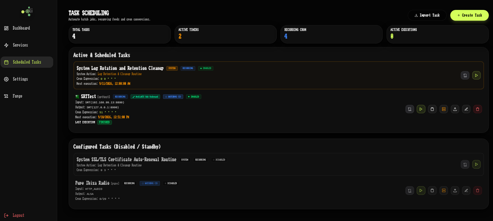

### 🔒 11. HTTPS & Let's Encrypt SSL Manager
- **Automated SSL/TLS Certificates**: Request and renew Let's Encrypt certificates directly from the GUI panel.
- **ACME Challenge Handler**: Integrated HTTP-01 challenge router (`/.well-known/acme-challenge/*`) for automated domain verification.
- **Status & Monitoring**: Real-time display of certificate validity, domain bindings, and automated expiration warnings.

### 💾 12. Granular Backup & Restore
- **Selective Section Toggles**: Export and import specific configuration parts (e.g., backing up media services, virtual desktops, web kiosks, scheduled tasks, storage volumes, software engines, and peer federation credentials while leaving SMTP credentials or network port configs unchanged).
- **Format Verification & SSOT Synchronization**: Validates file integrity, application signature, and version compatibility before performing atomic SQLite database insertions (`SystemSettings`) and configuration file updates. Dynamic desktop-name re-resolution ensures web kiosks bind correctly to restored parent virtual desktops.

### 🗄️ 13. Storage, HTTP HLS Routes, Log Retention & Branding
- **Storage Management & HTTP HLS Delivery**: Configure local or mounted storage volumes, monitor disk space usage in real time, and map custom HTTP route paths (`/route_path -> HLS Storage`) with CORS and video caching headers to serve live and archived HLS manifests (`.m3u8`) and segments (`.ts`) directly through the web engine.
- **Decoupled Logging & Automated Rotation**: Decouples application server logs (`ffmpeg-gui.log`) from HTTP access logs (`access.log`), with noise suppression for media chunks and copytruncate rotation with configurable retention periods.
- **Branding Customization**: Customize the application name, panel headers, and console branding directly from the interface settings.

### 🔔 14. State-Based SMTP Notifications
- **Alert Fatigue Prevention**: Stateful notification queue that filters redundant alerts. Emails are dispatched exclusively on initial stream crashes, recovery success, and final retry exhaustion.
- **System Health Checks**: Active warnings for pending SSL/TLS certificate expirations, disk space utilization exceeding 90%, and debounced hardware thermal overheating and throttling events.

### 📟 14. CFA635 LCD Display Driver
- **Serial LCD Integration**: Direct driver control for CrystalFontz CFA635 USB/Serial displays. Renders live CPU, RAM, active stream counts, locator beacons, and handles backlight dimming timeouts.
- **Bicolor Status LEDs**: Maps physical LEDs to profile monitors:
  - Heartbeat status indicator.
  - Active stream/service health.
  - Task execution monitor (reflects latest execution results).
  - High-resource alerts.
  - Storage usage alerts.
  - Recording indicator (active REC pilot).
  - Federated peer status monitor (`P2P` profile with worst-state aggregation).
  - Thermal overheat and throttling alert (`THERM` profile).

### 🌐 15. Styling & Localization
- **Multi-Theme Engine**: 5 visual styles (Studio Dark, Cyberpunk Neon, Nordic Frost, Broadcast Light, Warm Paper) loaded instantly without page flash.
- **Full Translations**: English, Spanish, and Catalan interfaces with 100% i18n parity.
- **Modern 4-Column 1080p Layout**: Responsive 4-column dashboard grid layout maximizing space utilization on high-resolution broadcast control monitors.

### 🌡️ 16. Industrial Hardware Telemetry & Thermal Shielding
- **Kernel-Level Health Extraction**: Direct `/sys/class/hwmon` and `/sys/devices/system/cpu` reading with package/core temperatures, cooling fan RPM tachometers, and CPU throttling detection (`throttle_active`, `package_throttled`, `core_throttled`).
- **Specialized Card Telemetry**: AudioScience DSP load and temperature tracking via `hpicontrol.py`, Magewell Pro Capture FPGA core temperatures, and Blackmagic DeckLink PCIe link generation/bus width.
- **Debounced Multi-Tier Thermal Alerting**: SMTP email alerts with 15-minute hysteresis cooldowns, Crystalfontz CFA635 USB LCD red LED `THERM` alerts, and dashboard alarms.
- **Active Thermal Protection Shielding**: Optional toggle (`thermal_active_protection`) that automatically blocks starting new scheduled tasks or FFmpeg Forge compilation jobs when critical temperature limits are reached, protecting broadcast transcoders from thermal damage.

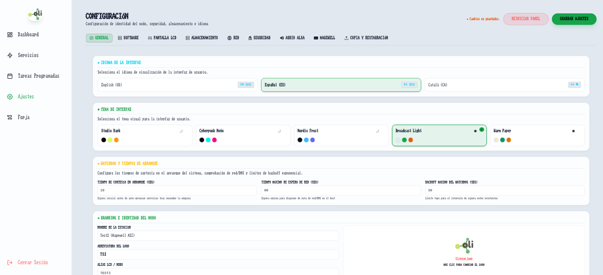

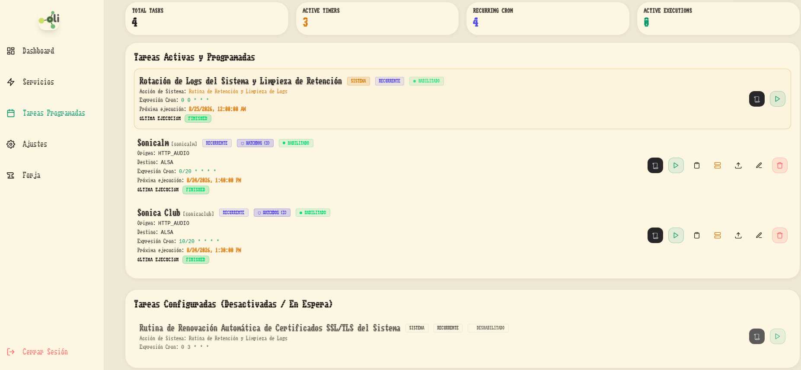

### 🛡️ 17. Brute-Force Protection & Security Logging (Fail2ban Ready)
- **In-Memory IP Lockout**: Built-in guard tracks failed login attempts in RAM and temporarily bans abusive clients (`HTTP 429 Too Many Requests` / `Retry-After`) with zero SQLite overhead during attacks.
- **Permanent Loopback Immunity**: Localhost and loopback interfaces (`127.0.0.1`, `::1`) are hardcoded as immune to prevent locking out local SSH tunnels or reverse proxies, alongside custom CIDR/IP whitelisting.
- **Standardized Logs for External IDS/IPS**: Standardized warning events emitted in `ffmpeg-gui.log` and Nginx-format HTTP lines in `access.log` with real client IP resolution via `X-Forwarded-For` and `X-Real-IP`.
- **Ready-to-use Fail2ban Rules**: Pre-configured filter and jail definitions are included in the repository under [`packaging/fail2ban/`](packaging/fail2ban/):
  - `packaging/fail2ban/filter.d/ffmpeg-gui.conf` $\rightarrow$ copy to `/etc/fail2ban/filter.d/`
  - `packaging/fail2ban/jail.d/ffmpeg-gui.local` $\rightarrow$ copy to `/etc/fail2ban/jail.d/`

```bash
# 1-step installation
sudo cp packaging/fail2ban/filter.d/ffmpeg-gui.conf /etc/fail2ban/filter.d/
sudo cp packaging/fail2ban/jail.d/ffmpeg-gui.local /etc/fail2ban/jail.d/
sudo fail2ban-client reload
```

### 🧰 18. Administrative Rescue CLI (`ffmpeg-gui-admin`)
- **Out-of-Band Recovery**: Command-line utility to diagnose and recover instances without browser access.
- **Admin Password Reset**: Reset administrative passwords directly from the terminal (`reset-admin`).
- **IP Ban & Lockout Clearing**: Clear active in-memory brute-force lockouts (`reset-lockout` / `reset-all`) in case an administrator gets locked out.
- **Instance Diagnostics**: Inspect active ports, database status, systemd service health, and current listening interfaces (`status`).

```bash
# Quick CLI usage
./bin/ffmpeg-gui-admin status
./bin/ffmpeg-gui-admin reset-lockout
./bin/ffmpeg-gui-admin reset-admin
```

### 🌐 18. Dynamic Interface Binding & Live Firewall Matrix
- **Dynamic Interface Enumeration**: Detects all physical, virtual, and loopback interfaces (IP, netmask, MAC, speed, and link state).
- **Fail-Safe Bind Resolver**: Prevents administrative lock-out if network interfaces change, drop, or migrate; automatically falls back to `0.0.0.0` with clear diagnostic warnings.
- **Daemon Integration**: Bind FFmpeg-GUI core, MediaMTX, and Icecast2 to specific interfaces or individual IP addresses.
- **Live Firewall Matrix & Rule Generator**: Real-time socket scanner reporting live listening ports across all daemons with 1-click copyable UFW and iptables rule sets.

---

## Architecture

- **Backend**: FastAPI (Python), SQLite (SQLAlchemy), and Uvicorn.
- **Frontend**: React 19, TypeScript, Vite, Tailwind CSS, and `react-i18next`.
- **System Wrapper**: Integrates with systemd service units running in user-space or system-wide space.

---

## Development Note

This project has been developed entirely in pair-programming using AI agent tools (collaborating with Google DeepMind's Antigravity coding assistant).
